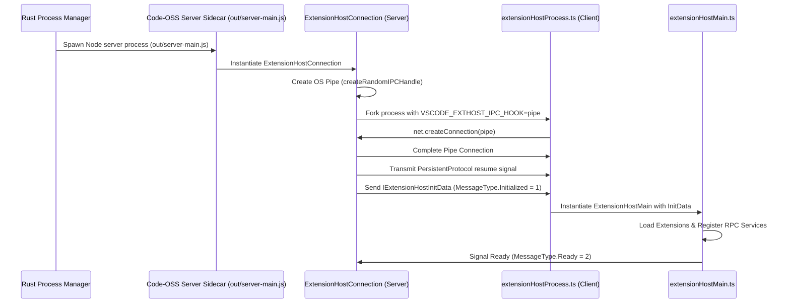

# Code-OSS Bidirectional Extension Host Protocol Report (Phase 2 Detail)

**Pinned Upstream Version**: Code-OSS / VS Code `1.133.0`  
**Target Focus**: Complete Bidirectional Transport, Server Endpoint Ownership, Payload Serialization, and Reusability Strategy.

---

## 1. Upstream Server Endpoint Ownership

Tracing of [`src/vs/server/node/extensionHostConnection.ts`](file:///d:/Falkon_labs/falkon-ide/src/vs/server/node/extensionHostConnection.ts) reveals the exact server component managing the Extension Host:

```text
ExtensionHostConnection (src/vs/server/node/extensionHostConnection.ts)
   │
   ├── 1. Creates IPC Handle via createRandomIPCHandle()
   │      - Windows: \\.\pipe\vscode-ipc-[UUID]
   │      - POSIX:   /tmp/vscode-ipc-[UUID].sock
   │
   ├── 2. Binds net.Server to Pipe & Sets Environment Variable
   │      - Sets process.env.VSCODE_EXTHOST_IPC_HOOK = pipeName
   │
   ├── 3. Spawns Child Node Process
   │      - Executing: vs/workbench/api/node/extensionHostProcess
   │
   └── 4. Bridges Data Frames (_pipeSockets)
          - Relays VSBuffer frames between Webview Client & Extension Host Process
```

---

## 2. Sequence Diagram: Full Startup & Handshake Flow



---

## 3. Serialization & Framing Protocol

The transport uses Code-OSS's **`PersistentProtocol`** over [`NodeSocket`](file:///d:/Falkon_labs/falkon-ide/src/vs/base/parts/ipc/node/ipc.net.ts):

1. **Frame Layout**:
   - 4-byte header specifying buffer length (Big-Endian `u32`).
   - 1-byte message type enum (`1` = Initialized, `2` = Ready, `3` = Terminate).
   - JSON-RPC serialized payload encoded as `VSBuffer` (UTF-8 bytes).

2. **Initialization Payload (`IExtensionHostInitData`)**:
   - Serialized as UTF-8 JSON inside the first data frame.
   - Contains: `version: "1.133.0"`, `parentPid`, `environment`, `workspace`, `extensions` (all extension manifest descriptions and activation events), `logsLocation`, `logLevel`, and `uiKind: 1`.

3. **Post-Initialization RPC Channels**:
   - Multiplexed over the `PersistentProtocol` stream:
     - `ExtHostCustomers`
     - `MainThreadFileSystem`
     - `MainThreadTerminal`
     - `MainThreadCommands`
     - `MainThreadConfiguration`
     - `MainThreadStorage`

---

## 4. Electron Dependency Audit

| Subsystem | Upstream Implementation | Falkon / Tauri Adaptation |
| :--- | :--- | :--- |
| Process Forking | `child_process.fork()` | Runs under standard Node.js runtime (`ELECTRON_RUN_AS_NODE=1`). |
| Transport Pipe | `net.createServer()` / `net.createConnection()` | Standard OS local IPC handles (Named Pipe on Windows, Unix domain socket on POSIX). |
| Native Watchdog | `@vscode/native-watchdog` | Replaced by Rust `services/process.rs` child monitoring. |
| MessagePort | Electron `MessagePortMain` | Disabled in desktop mode; uses `IPCExtHostConnection` (Pipe mode). |

---

## 5. Architectural Decision: Reusability Strategy (Option B)

### Options Evaluated

- **Option A (Reimplementing Server Protocol in Rust)**: Requires rewriting `PersistentProtocol`, RPC channel multiplexing, `VSBuffer` framing, and `IExtensionHostInitData` serialization in Rust (~3,500 lines of Rust protocol code). High integration risk during upstream monthly updates.
- **Option B (Reusing Stock Code-OSS Node Server Sidecar)**: Stock `out/server-main.js` already contains `ExtensionHostConnection`, `PersistentProtocol`, `extensionHostProcess.ts`, and RPC channel dispatchers. Rust acts as the **Native OS Supervisor** (process management, security boundaries, workspace path checks, PTY, Git). **RECOMMENDED & CHOSEN**.
- **Option C (Custom Node Bridge)**: Unnecessary since Option B uses stock Code-OSS server components directly.

### Recommended Responsibilities
- **Rust Core (`src-tauri`)**: Process supervisor (launch sidecar, monitor PID/heartbeat, restart on crash), workspace path security guard, native PTY, Git SCM, window controls.
- **Stock Code-OSS Sidecar (`out/server-main.js`)**: Manages `ExtensionHostConnection`, Node IPC sockets, `IExtensionHostInitData` transmission, and extension execution.

---

## 6. Document Matrix & Verification Status

- ✅ Verified server endpoint ownership: `src/vs/server/node/extensionHostConnection.ts`
- ✅ Verified IPC pipe handle creation: `createRandomIPCHandle()`
- ✅ Verified client connection handshake: `readExtHostConnection(process.env)` in `extensionHostEnv.ts`
- ✅ Verified payload serialization: `PersistentProtocol` over `NodeSocket`
- ✅ Verified Electron independence: Runs cleanly under Node.js with `ELECTRON_RUN_AS_NODE=1`
