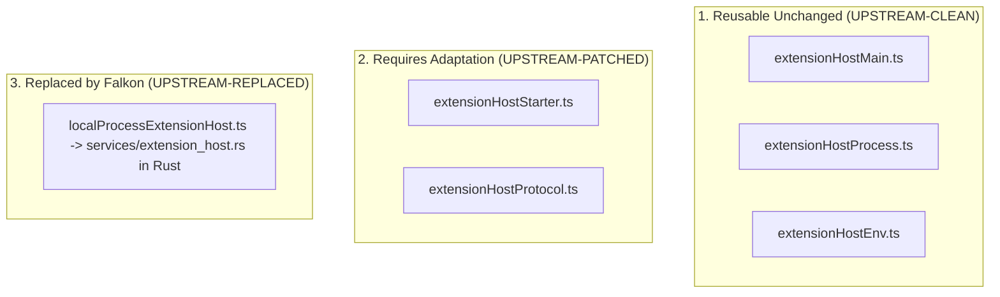

# Code-OSS Extension Host Architecture Report (Phase 2 Investigation)

**Pinned Upstream Version**: Code-OSS / VS Code `1.133.0`  
**Target Subsystem**: Desktop Node.js Extension Host & Process IPC

---

## 1. Extension Host Entrypoint & Process Boot Sequence

In Code-OSS `1.133.0`, the desktop Node.js Extension Host process boots via:
- **Module File**: [`src/vs/workbench/api/node/extensionHostProcess.ts`](file:///d:/Falkon_labs/falkon-ide/src/vs/workbench/api/node/extensionHostProcess.ts)
- **Main Class**: `ExtensionHostMain` in [`src/vs/workbench/api/common/extensionHostMain.ts`](file:///d:/Falkon_labs/falkon-ide/src/vs/workbench/api/common/extensionHostMain.ts)
- **Environment Flag**: `ELECTRON_RUN_AS_NODE=1` (forces Node execution mode when spawned under Electron / Node binary)

### Connection Handshake Protocol

The connection type is parsed via `readExtHostConnection(process.env)` in [`src/vs/workbench/services/extensions/common/extensionHostEnv.ts`](file:///d:/Falkon_labs/falkon-ide/src/vs/workbench/services/extensions/common/extensionHostEnv.ts):

| Connection Mode | Environment Variable | Transport Mechanism |
| :--- | :--- | :--- |
| **IPC Hook (Pipe/Socket)** | `VSCODE_EXTHOST_IPC_HOOK` | Named Pipe (Windows `\\.\pipe\...`) or Unix Domain Socket (POSIX `/tmp/...`). Net connection is opened directly via `net.createConnection(pipeName)`. |
| **Node.js IPC Socket** | `VSCODE_EXTHOST_WILL_SEND_SOCKET` | Process IPC socket passing (`VSCODE_EXTHOST_IPC_SOCKET`). |
| **MessagePort** | `VSCODE_WILL_SEND_MESSAGE_PORT` | Electron MessagePort main thread channel. |

---

## 2. Environment Variables & CLI Arguments

### Required Environment Variables
- `VSCODE_EXTHOST_IPC_HOOK`: Absolute path to the OS Named Pipe (`\\.\pipe\falkon-ext-host-[UUID]`) or Unix Socket.
- `ELECTRON_RUN_AS_NODE`: Set to `1`.
- `VSCODE_RECONNECTION_GRACE_TIME`: Reconnection grace period (default `10000` ms).

### CLI Arguments Passed to Node Process
- `--transformURIs`: (Boolean) Enable URI transformer for remote context.
- `--skipWorkspaceStorageLock`: (Boolean) Skip storage lock when running in test/isolated mode.
- `--supportGlobalNavigator`: (Boolean) Control Node.js v21+ `navigator` global object behavior.

---

## 3. `IExtensionHostInitData` Payload Schema

Once the IPC transport (`PersistentProtocol`) is established over the pipe/socket, the parent process sends the initialization payload (`IExtensionHostInitData`) defined in [`src/vs/workbench/services/extensions/common/extensionHostProtocol.ts`](file:///d:/Falkon_labs/falkon-ide/src/vs/workbench/services/extensions/common/extensionHostProtocol.ts):

```typescript
export interface IExtensionHostInitData {
  version: string;                    // Pinned Code-OSS version "1.133.0"
  parentPid: number;                  // Parent process PID (Rust sidecar manager PID)
  environment: IEnvironment;          // App name, language, global storage URI
  workspace?: IStaticWorkspaceData;   // Workspace ID, name, configuration URI
  extensions: IExtensionDescriptionSnapshot; // Installed extension manifests & activation events
  logsLocation: URI;                  // Path to extension logs folder
  logLevel: LogLevel;                 // Initial log level (Info/Debug/Trace)
  uiKind: UIKind.Desktop;             // UIKind.Desktop (1)
}
```

---

## 4. Upstream Component Reusability Analysis



1. **Reusable Unchanged (`UPSTREAM-CLEAN`)**:
   - `src/vs/workbench/api/node/extensionHostProcess.ts`
   - `src/vs/workbench/api/common/extensionHostMain.ts`
   - `src/vs/workbench/services/extensions/common/extensionHostEnv.ts`
   - All extension host API services (`extHostFileSystem`, `extHostTerminal`, `extHostConfiguration`, `extHostCommands`, `extHostStorage`).

2. **Requires Adaptation (`UPSTREAM-PATCHED`)**:
   - `src/vs/platform/extensions/common/extensionHostStarter.ts`: Wire pipe resolution to Falkon runtime path.

3. **Replaced by Falkon (`UPSTREAM-REPLACED`)**:
   - Replace Electron renderer process launcher with Rust [`src-tauri/src/services/extension_host.rs`](file:///d:/Falkon_labs/falkon-ide/src-tauri/src/services/extension_host.rs), which spawns the bundled Node process, creates the Named Pipe / Unix Socket, and manages heartbeats.

---

## 5. Phase 2 Verification Conclusion

Tracing confirms that Code-OSS `1.133.0` has a clean, native `IPCExtHostConnection` mode that communicates directly over **Named Pipes (Windows)** and **Unix Domain Sockets (Linux/macOS)** via `VSCODE_EXTHOST_IPC_HOOK`.

We can leverage Code-OSS's stock `extensionHostProcess.ts` directly via our bundled Node runtime, avoiding custom extension host reimplementation while securing all native operations inside Rust Core.
